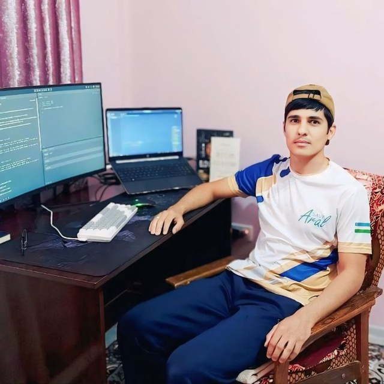

# Jahongir Nusratov - <q><i>The Frontend Developer</i></q>

## #Contacts

- Gamil - nusratovjahongir@gmail.com
- LinkedIn - [jahongir-nusratov](www.linkedin.com/in/jahongir-nusratov)
- Telegram - [@Mr_Jakhongir](https://t.me/Mr_Jakhongir)
- github - [mrjakhongir](https://github.com/mrjakhongir)

## #About me

I’m Nusratov Jahongir, a fullstack web developer and freelancer from Bukhara with over 2 years of professional experience. My main expertise is in React and Next.js, including server-side rendering, and I have strong skills in TypeScript, Tailwind CSS, ShadCN, Ant Design, and Material-UI. I also work with Node.js, PostgreSQL, Firebase, and API integrations, building scalable applications from frontend to backend.

Beyond coding, I enjoy solving algorithmic challenges on LeetCode, working with databases, and building Telegram bots for automation, education, and business workflows. I’m passionate about creating efficient, user-friendly applications and continuously learning to expand my expertise.

## #Skills

- HTML
- CSS, SCSS, TailwindCSS
- JavaScript, TypeScript
- React, Next
- VsCode, Cursor
- Git, GitHub, GitLab
- MUI, Shadcn, AntD, ChakraUI
- Windsurf, github copilot, ClaudeAI
- Zustand, Tanstack React Query, Redux Toolkit, RTK Query

## #Work Experience

#### Frontend developer - PROUnity

- Mar 2024 - Jun 2024
- React, SCSS, Redux Toolkit, Next, TypeScript

#### Next.js programmer - Acertip

- Jun 2024 - Jul 2024
- Next, TypeScript, TailwindCSS

#### Frontend developer - udevs

- Jun 2025 - present
- React, Next, TypeScript, ChakraUI, Tanstack Query, Tailwind, Shadcn

## Education

- Bachelor degree - Bukhara Engineering Technological Institute
- Frontend development bootcamp - Scrimba.com
- Fullstack development bootcamp - Udemy
- JS/FE COURSE EN 2024Q4 (JAVASCRIPT) - RSSchool

## #Languages

- Uzbek - native
- English - C1
- Russian - B2

## #Code sample

<pre>
  function squareDigits(num) {
    return Number(
      num
        .toString()
        .split('')
        .map(d => d ** 2)
        .join('')
        );
  }
</pre>

## #Projects

### Antikdecor - [link](https://antikdecor.ru/)

### utas - [link](https://utas.uz/)

### osnova - [link](https://my.osnovaedu.uz/login/uz)

### coffe house - [link](https://coffee-house-rsschool.netlify.app/)

### gifts - [link](https://christmasshoprsschool.netlify.app/)

### udevs - [link](https://usevs-clone.netlify.app/)
